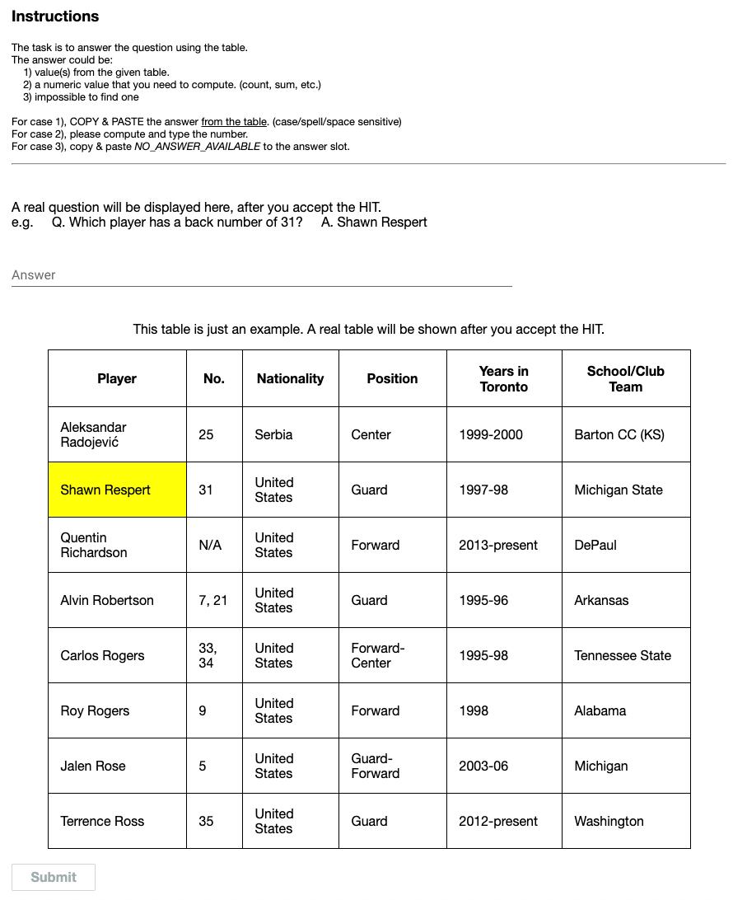

# The (approximate) human performance of WikiSQL dataset

We (approximately) measured the human performance of [WikiSQL dataset](https://arxiv.org/abs/1709.00103), using the crowdsourcing platform, Amazon Mechanical Turk.
We used the randomly sampled 1,551 examples (\~10%) from the WikiSQL test set consisting of 15,878 examples in total, and 246 different qualified crowdworkers participated in the task.

The sample task page for crowdworkers is shown below:

The crowd task resembles the execution of SQL query to be comparable with the execution accuracy adapted in the [official WikiSQL leaderboard](https://github.com/salesforce/WikiSQL).
The accuracy of crowdworkers on the randomly sampled test data is 88.3%, while the execution accuracy of our model (SQLova) over 1,551 samples are 86.8% (w/o EG) and 91.0% (w/ EG).

Please note that the Ground Truth values in the [measurement result file](result.tsv) means the SQL execution results of ground truth SQL queries. The SQL execution was conducted by the script from the [official leaderboard](https://github.com/salesforce/WikiSQL). The retrieved Ground Truth values are a bit erroneous and thus the experts (us) manually checked the actual answers of given questions and checked correctness of all crowd answers.

The details of human performance measurement can be found at [our paper](https://arxiv.org/pdf/1902.01069.pdf)'s section 5.2 Measuring Human Performance.
